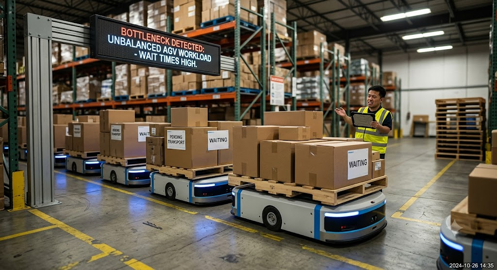
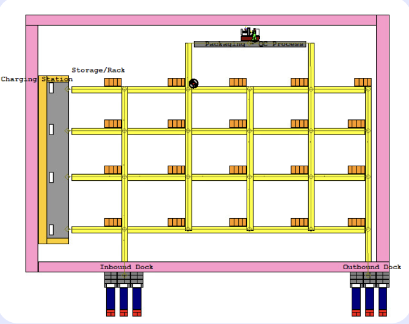

# Distribution Center AGV Simulation

Smaller-scale simulation of a distribution center — modeling order flow from arrival to shipment, built in **Arena** for a 2025 System Simulation term project.

## Problem Statement

Recent surges in logistics volume have caused bottlenecks in small-scale distribution centers, particularly in AGV (Automated Guided Vehicle) transport segments. Increased transporter wait times drive up overall lead time and reduce system efficiency. This project analyzes the imbalance between AGV fleet size and workload to derive the optimal number of transporters needed for stable performance.

  
   
  <em>Figure 1: Problem Formulation</em>

## Network Design
The center's layout is divided into four functional zones, connected via intersections and network links that AGVs (Transporters) traverse:

- **Inbound Dock** — receiving point for incoming goods
- **Storage/Rack Zone** — product storage area
- **Charging Station** — AGV standby and charging
- **Outbound Dock** — shipment processing point

  
  <em>Figure 2: Network Diagram</em>

## Model Logic

- **Closed-loop system**: a global stock variable (`vStock[i,j]`) keeps inbound/outbound flow synchronized in real time.
- **Search**: queries stock levels to locate a valid index (rack address).
- **Decide**: on search failure, entities route through a Delay module before retrying (backorder loop).
- **Assign**: synchronizes stock data on order/inbound/outbound events.
- **Seize/Release**: In/Out ports and main equipment (Body) resources are seized and released to enforce physical buffer limits.
- **Wait**: entities wait for the preceding resource (Body) to free up, preventing cross-process collisions.

  
   
  <em>Figure 2: Logic diagram of distribution center</em>

## Visualization

- **Logic Flow Diagram** — process flow from order arrival through Search/Decide/Assign/Seize-Release/Wait logic to shipment completion
- **Network Diagram** — spatial layout of Inbound Dock, Storage/Rack Zone, Charging Station, and Outbound Dock, connected via intersections and network links
- **Result Visualization** — real-time dashboards for:
  - Storage inventory status (per-rack stock levels)
  - Packing Process entity queue depth
  - AGV fleet count and deceleration/idle state

  
   
  <em>Figure 3: Arena simulation results — waiting time and queue statistics</em>

## Simulation Setup

| Type | Element | Description |
|------|----------|-------------|
| Variable | `vStock(i,j)` | 4×5 array for per-product inventory tracking |
| Attribute | `aRackID` | Rack address resolved via Search |
| Attribute | `Product/OrderType` | Product type assigned by probability distribution |
| Transporter | AGV | 4 units, running at speed 2.2 |

**Scenario**: Inbound arrivals every 3 minutes, orders every 2 minutes, simulated over a 4-hour run.

## Results

- All Transporters bottleneck at the **Packing Process** segment by the end of the run.
- **Request 3 Queue** (Transporter call point) averages **16.4** entities waiting — indicating transport delays from AGV shortage.
- Recommended improvements: increase Packing Process throughput and parallelize equipment to expand process capacity.

  
   
  <em>Figure 4: Analysis</em>

## Conclusion

The model quantitatively verifies distribution center flow and confirms bottlenecks at the Packing Process and Request 3 (Transporter call) stages due to AGV shortage. This provides a foundation for future operational improvement experiments — e.g., Transporter fleet expansion and process parallelization.

## Design Evaluation Notes

- **Strengths**: Effectively visualizes distribution center flow and pinpoints bottleneck locations.
- **Limitations**: Does not account for exception scenarios (e.g., equipment failure).
- **Open-ended problem**: Scalability to more product types and additional storage zones (beyond the current 2-product setup) has not yet been validated for collision-free operation.
- **Economic/ROI**: AMR/labor scaling should be pre-validated for ROI, though maintenance and training costs may raise operating expenses.
- **Social/ethical**: Workload balancing may surface staffing reallocation concerns.
- **Safety**: Better workload distribution can indirectly reduce worker fatigue and safety risk.

2025 System Simulation Term Project — Soongsil University
